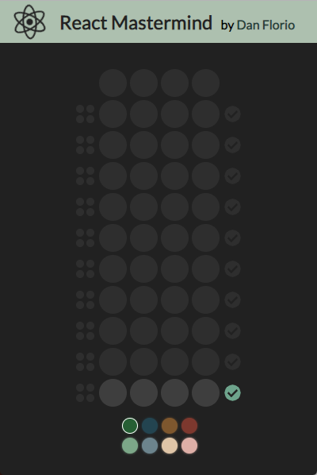

# React Mastermind
A clone of the game Mastermind using React.js.

## How to play:
You have 10 guesses to figure out the secret 4-color code.
* Select a color from the bottom, and choose a slot in the current row to place it.
* When the row is filled, press the check button to test your guess.
* For every color that is correct, but in the wrong slot, a white light will appear to the left of your guess.
* For every color that is correct, and in the correct slot, a black light will appear to the left of your guess.

Notes:
* The position of the black/white lights is not related to your guess, only the number of black/white lights.
* The secret code doesn't contain any duplicate colors.
